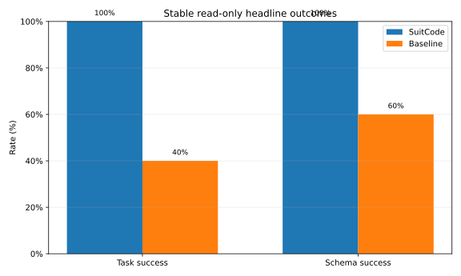

# SuitCode

**Your agent can search the repo. SuitCode asks the toolchain.**

**Know what breaks, what to run, and why.**

Stop guessing and exploring blindly. SuitCode turns repo/toolchain signals into deterministic actions.

SuitCode is an MCP server for repository intelligence that reads the same surfaces your build, test, quality, and language tooling already define. Instead of giving your agent another repo map or another search index, it gives grounded answers like ownership, impact, minimum validation sets, deterministic targets, and explicit unsupported boundaries.

## Current MCP Shape

SuitCode now has two public profiles:

- `core`: the small default agent-facing surface
- `full`: the larger expert/compatibility surface

The `core` profile is the intended default for agents. Its primary tools are:

- `understand_repository`
- `understand_file`
- `what_changes_if_i_edit_this`
- `what_should_i_run`
- `can_i_do_this`

The target-bearing core tools accept file lists and return both:

- aggregate results for the whole change set
- per-target detail and evidence

This keeps the tool surface small while reducing repeated per-file calls.

Two of the heavier core tools also accept `detail_level`:

- `understand_file`
- `what_changes_if_i_edit_this`

Detail levels:

- `compact`: smallest curated deterministic answer
- `standard`: balanced deterministic answer with limited previews
- `full`: current rich evidence payload

Current default:

- `compact`

## Why It Is Different

- Search tells the agent where text appears. SuitCode asks the actual toolchain what owns the file, what depends on it, and what should run.
- Repo maps summarize structure. SuitCode returns deterministic actions and provenance-rich evidence.
- RAG and index layers guess from documents. SuitCode tells the agent when something is unsupported instead of inventing a target.
- Generic shell flows leave the agent to compose commands. SuitCode exposes exact test, build, and runner actions where the provider can prove them.

## Quick Proof

- Stable downstream A/B: SuitCode `5/5` vs baseline `2/5`
- Median turns per stable headline task: SuitCode `3` vs baseline `16`
- Stable execution A/B: SuitCode `2/2` vs baseline `0/2`



These numbers come from the current neutral Codex v7 benchmark: same prompt, same task schema, same repo, same timeout, only SuitCode availability differs.

## Install

Primary install path:

```bash
pipx install git+https://github.com/GreenFuze/suit-code.git
```

Secondary install path:

```bash
uv tool install git+https://github.com/GreenFuze/suit-code.git
```

Then connect SuitCode to your agent with the installer:

```bash
suitcode-install --agent codex
```

Replace `codex` with `claude`, `cursor`, or `all` as needed.

Installed entrypoints:

- `suitcode-mcp-core`
- `suitcode-mcp --profile core`
- `suitcode-mcp --profile full`

Repository launchers in a source checkout:

- Windows: `run_mcp.bat`
- macOS/Linux: `run_mcp.sh`

The repository launchers default to `core`.

Current installer note:

- `suitcode-install` still wires `suitcode-mcp`
- if you want the smaller recommended `core` surface today, use the manual MCP config shown below or point your agent at `run_mcp.bat` / `run_mcp.sh` from a source checkout

## Connect To Your Agent

### Codex

Install:

```bash
suitcode-install --agent codex
```

Verify:

```bash
codex mcp list
```

If you used `suitcode-install`, switch the generated entry to the `core` command below if you want the smaller default surface today.

Manual fallback:

Windows `~/.codex/config.toml`

```toml
[mcp_servers.suitcode]
transport = "stdio"
command = "cmd"
args = ["/c", "suitcode-mcp-core"]
enabled = true
```

macOS/Linux `~/.codex/config.toml`

```toml
[mcp_servers.suitcode]
transport = "stdio"
command = "suitcode-mcp-core"
args = []
enabled = true
```

Source checkout fallback:

Windows

```toml
[mcp_servers.suitcode]
transport = "stdio"
command = "cmd"
args = ["/c", "C:/src/github.com/GreenFuze/suit-code/run_mcp.bat"]
enabled = true
```

macOS/Linux

```toml
[mcp_servers.suitcode]
transport = "stdio"
command = "/path/to/suit-code/run_mcp.sh"
args = []
enabled = true
```

### Claude Code

Install:

```bash
suitcode-install --agent claude
```

Verify:

```bash
claude mcp list
```

Then open Claude Code and run `/mcp`.

If you used `suitcode-install`, switch the generated entry to the `core` command below if you want the smaller default surface today.

Manual fallback:

Windows

```bash
claude mcp add --transport stdio --scope user suitcode -- cmd /c suitcode-mcp-core
```

macOS/Linux

```bash
claude mcp add --transport stdio --scope user suitcode -- suitcode-mcp-core
```

### Cursor

Install:

```bash
suitcode-install --agent cursor
```

Verify:
- restart Cursor
- confirm `suitcode` appears in MCP tools

If you used `suitcode-install`, switch the generated entry to the `core` command below if you want the smaller default surface today.

Manual fallback:

Windows `%USERPROFILE%\\.cursor\\mcp.json`

```json
{
  "mcpServers": {
    "suitcode": {
      "command": "cmd",
      "args": ["/c", "suitcode-mcp-core"]
    }
  }
}
```

macOS/Linux `~/.cursor/mcp.json`

```json
{
  "mcpServers": {
    "suitcode": {
      "command": "suitcode-mcp-core",
      "args": []
    }
  }
}
```

## One End-To-End Example

Prompt:

> A bug report points at `src/suitcode/mcp/service.py`. What owns it, what should I inspect first, and what exact validation set should run before I trust a fix?

SuitCode gives the agent deterministic surfaces for:
- the owning component
- the dependency frontier that defines the debugging surface
- related tests and quality gates
- the minimum verified change set

That lets the agent move from a vague bug report to a bounded validation plan instead of broad file exploration.

Full example:
- [bug-report-to-validation.md](docs/examples/bug-report-to-validation.md)

## Supported Today

Current repository/provider support:
- Python
- npm
- Go
- Markdown

Current agent setup paths:
- Codex
- Claude Code
- Cursor

Current analytics/evaluation support:
- Codex: live evaluation and passive analytics
- Claude Code: passive analytics
- Cursor: passive analytics

Current Go scope:
- single-module repositories
- multi-module repositories with no `go.work`
- mixed repositories with Go module subtrees and no `go.work`
- Go code intelligence through `gopls` for symbols, definitions, references, and implementation candidates
- `go.work` support comes next

Current markdown scope:
- deterministic markdown file ownership
- section and heading structure with line ranges
- fenced code blocks
- links
- frontmatter keys and ranges
- checklist items

Current frontend/npm scope:
- mixed repo attachment discovery from a larger repo root
- deterministic file ownership for package-owned source and `public/` assets
- concrete npm build/test/runner actions from package scripts
- TypeScript code intelligence through `typescript-language-server`

## Evidence

- [Codex v7 evidence summary](docs/evidence/codex-v7/README.md)

The benchmark is neutral A/B on bounded downstream tasks. Tokens are reported as transcript-estimated visible content, not billing totals.

## More Details

- [FEATURES.md](FEATURES.md) for the full feature and MCP tool reference
- [LICENSE.md](LICENSE.md)
