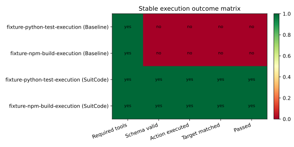

# SuitCode Evidence: Codex v7

This page is the stable README-safe evidence export for the current Codex v7 comparison baseline.

## Headline

- Stable downstream A/B: SuitCode `5/5` vs baseline `2/5`
- Median turns per stable headline task: SuitCode `3` vs baseline `16`
- Stable execution A/B: SuitCode `2/2` vs baseline `0/2`
- Supporting token evidence: SuitCode `2793` vs baseline `50956` transcript-estimated visible tokens per stable headline task

## Figures

## Provenance

- Report id: `codex-comparison-7e510e57620f40509ee4a01f5f86094f`
- Generated at: `2026-03-19T10:54:59.020Z`
- Model: `gpt-5.4`
- Git commit: `675acafc530af99d5d6783347e1fc80cb78ab7cf`
- Full comparison markdown: `.suit/evaluation/codex/comparisons/2026-03-19T10-54-59Z__codex-comparison-7e510e57620f40509ee4a01f5f86094f/comparison.md`
- Full comparison directory: `.suit/evaluation/codex/comparisons/2026-03-19T10-54-59Z__codex-comparison-7e510e57620f40509ee4a01f5f86094f`

This export is generated from the canonical comparison artifact rather than hand-maintained.
