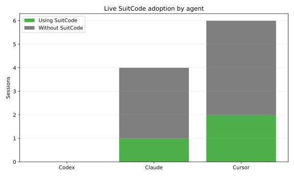

# SuitCode Research Notes, v1

## Purpose

This document records the current research story of SuitCode as of March 2026.

It is not a final paper. It is a working research note intended to preserve the design trajectory, the empirical evidence behind major pivots, and the current interpretation of results. The text should therefore be read as versioned internal research documentation rather than as a publication-ready claim set.

## Research Question

The central question behind SuitCode is:

> Can a coding agent reduce token use and task uncertainty by querying deterministic repository intelligence directly, instead of reconstructing that intelligence through repeated search, file reading, and command synthesis?

SuitCode's hypothesis has always been stronger than “repo tools are useful.” The hypothesis is that a coding agent benefits when the repository intelligence layer answers direct task questions such as ownership, impact, and minimum validation with explicit provenance and explicit unsupported boundaries.

## Where The Project Started

The initial SuitCode direction emphasized:
- broad MCP coverage
- benchmarkable sub-capabilities
- explicit repository lifecycle and support inspection
- many lower-level tools for architecture, tests, quality, analytics, and execution
- formal benchmark artifacts across `tests/`, `.suit/`, `benchmarks/`, and `docs/`

This direction made sense for early-stage measurement. It provided:
- clear task decomposition
- deterministic scoring contracts
- measurable provenance and truth-coverage outputs
- reproducible A/B comparison against a baseline agent without SuitCode

In other words, the initial system was optimized first for lab visibility and benchmark control.

## What The Lab Showed

The latest canonical report for the earlier direction is:
- [March 19, 2026 canonical comparison](../../.suit/evaluation/codex/comparisons/2026-03-19T10-54-59Z__codex-comparison-7e510e57620f40509ee4a01f5f86094f/comparison.md)

On the controlled Codex v7 benchmark, that report showed strong bounded-task results:
- stable downstream A/B: SuitCode `5/5` vs baseline `2/5`
- median turns per stable headline task: SuitCode `3` vs baseline `16`
- stable execution A/B: SuitCode `2/2` vs baseline `0/2`
- median transcript-estimated visible tokens per stable headline task: SuitCode `2793` vs baseline `50956`

These results matter. They show that deterministic repository intelligence can materially reduce search-heavy trajectories on bounded downstream tasks.

However, they do not settle the product question.

## Why The Earlier Direction Failed In Practice

The practical failure mode was not “the benchmark was fake.” The failure mode was weaker external validity: the broader tool surface did not translate cleanly into natural live adoption.

### 1. The old surface optimized for decomposability, not for natural questions

The earlier tool inventory exposed many support and lifecycle steps such as:
- `inspect_repository_support`
- `open_workspace`
- `list_*`
- `describe_*`
- `get_*`

This was useful for precise benchmarking and expert inspection. It was less effective for ordinary coding sessions, where agents more naturally ask questions such as:
- what owns this file
- what changes if I edit it
- what should I run

The old surface required the agent to translate those high-level questions into a lower-level workflow. That translation cost was a product problem, not a repository-intelligence problem.

### 2. Live analytics showed uneven adoption across agents

The same March 19 report contains a live-usage chapter over a real repository window (`MyGamesAnywhere`). It shows that the benchmark win did not automatically translate into healthy multi-agent adoption.

From the live analytics section of that report:
- Codex: `3/3` observed sessions used SuitCode, with healthy adoption and average first-tool index `2.0`
- Claude Code: only `2/6` observed sessions used SuitCode, with average first-tool index `78.0` and `58929.5` transcript-estimated tokens before first SuitCode tool
- Cursor: `2/6` observed sessions used SuitCode, with partial adoption and incomplete native visibility

The main implication is direct: deterministic repo intelligence was valuable, but the way it was exposed was too hard to adopt consistently.

### 3. Historical first-tool patterns showed lifecycle friction

The passive adoption data in the March 19 comparison also shows a strong first-tool skew toward lifecycle/setup calls rather than direct task questions. In the historical Codex appendix, first-tool counts were dominated by `open_workspace`, while high-value task-shaped tools appeared later.

That matters because early tool choice is where token savings are either captured or lost. If the first interaction with SuitCode is a setup ceremony instead of a task answer, the agent has already spent uncertainty budget before receiving value.

### 4. The benchmark rewarded correctness, but product use required fit

The controlled benchmark correctly asked whether SuitCode could beat baseline search on bounded deterministic tasks. It did not fully test whether:
- agents would discover the right tool early enough in normal work
- agents would tolerate the setup workflow
- the tool responses were compact enough for natural session use
- docs/spec/non-code artifacts were handled gracefully enough to keep the tool useful across mixed change sets

In short, the earlier direction won the lab question but underperformed on the adoption question.

## The Steering Decision

The project therefore shifted from a benchmark-first tool inventory toward a product-first core surface.

The steering decision had four parts.

### 1. Replace the broad default surface with a small task-shaped core

The current recommended surface is now:
- `understand_repository`
- `understand_file`
- `what_changes_if_i_edit_this`
- `what_should_i_run`
- `can_i_do_this`

These are not arbitrary renames. They are the direct questions agents actually ask during coding work.

### 2. Keep the rich surface, but demote it to expert/research use

The old breadth was not discarded. It remains available in the `full` profile.

This preserves:
- research instrumentation
- expert debugging depth
- reproducibility against earlier work

But it no longer defines the recommended product interface.

### 3. Move generic policy into SuitCode core

Another design correction was architectural.

The revised rule is:
- providers generate raw deterministic evidence
- SuitCode core decides generic aggregation, ranking, exclusions, and minimization policy

This matters because many of the practical problems were not provider failures. They were cross-provider product problems:
- aggregate payload bloat
- over-broad validation plans
- noisy exclusions
- mixed code + docs/spec response quality

### 4. Optimize for compactness and early usefulness

Recent work therefore focused on:
- `compact` default detail levels
- ranked and capped aggregate previews
- explicit exclusions instead of hard failures for provider-owned docs/spec artifacts
- narrower validation selection for shared-file targets
- a direct path-based core flow with fewer lifecycle steps exposed to the agent

## What The Current Direction Looks Like

The current product state is materially different from the system reflected in the March 19 canonical report.

### Current core properties

- compact-by-default responses on the heavy core tools
- multi-file input through `repository_rel_paths`
- ranked and capped aggregate previews instead of raw unions
- deterministic docs/spec support for Markdown and OpenAPI
- explicit non-validation exclusions for non-executable structured artifacts
- deterministic React/TSX render and prop-flow edges
- deterministic TS/TSX invariant and local-flow findings when provable
- deterministic Go implementation candidates through `gopls`
- validation minimization that prefers narrower direct owner/build/test surfaces over broader dependents when both exist

### Why this new direction is more plausible in practice

The new direction is better aligned with actual coding-agent behavior because it reduces two separate forms of friction:
- **selection friction**: fewer tools, phrased as task questions
- **payload friction**: compact defaults and ranked aggregate previews

That is the product hypothesis now under active dogfooding: not only that deterministic intelligence improves answer quality, but that the *form* of the interface strongly determines whether agents use it early enough to matter.

## How The Current Results Show Up

At the time of writing, the benchmark artifact in the repository still reflects the earlier broader interface. The newer compact core is therefore ahead of the current canonical benchmark report.

That means the present evidence has two layers.

### Layer 1: canonical benchmark evidence

We already have strong formal evidence that deterministic repository intelligence helps on bounded tasks:
- better task completion
- fewer turns
- lower visible transcript cost
- correct deterministic validation/action selection

This result remains important and still motivates the project.

### Layer 2: newer live dogfooding evidence

The post-pivot direction has been validated mainly through live Codex sessions on real work rather than through a fresh canonical report.

Current internal observations are:
- the compact core is now used immediately in fresh repository-discovery sessions
- the most stable value is in repository understanding, file ownership, blast-radius estimation, and validation targeting
- mixed code + docs/spec change sets behave materially better than before because Markdown and OpenAPI are now first-class deterministic artifacts
- large multi-target aggregate payloads remain a live issue, but per-target compact usage is substantially healthier than before
- recent Codex dogfooding sessions commonly report meaningful token savings in the roughly `20%` to `40%` range, with the highest gains appearing in repository discovery and validation-planning passes rather than in late-stage line editing

These live observations are not yet a publication-grade benchmark. They are, however, the practical reason the project has continued in the new direction.

## Interpretation

The current research interpretation is therefore:

1. The original system established that deterministic repository intelligence can outperform baseline search and synthesis on bounded downstream tasks.
2. The same system also revealed an adoption problem: a broad, benchmark-friendly interface is not automatically a good product interface for live coding agents.
3. The current SuitCode direction treats interface shape as part of the research contribution, not merely as packaging.
4. The present working hypothesis is that a small, task-shaped, compact-by-default deterministic interface will produce better live token savings and more consistent early adoption than the earlier broad surface.

## Threats To Validity

Several threats remain and should be stated explicitly.

### 1. The canonical benchmark is still pre-pivot

The main report in the repository does not yet evaluate the compact core against the earlier broad interface. It evaluates SuitCode against baseline without SuitCode.

### 2. Recent live gains are not yet frozen into a canonical report

The current product direction is supported by live dogfooding and iterative observation. Those observations are valuable, but they do not yet carry the same methodological weight as the March 19 comparison.

### 3. Token accounting remains transcript-estimated

The benchmark and live reports use transcript-estimated visible content, not billing-accurate vendor token totals.

### 4. External validity is still agent- and repo-dependent

The March 19 report already showed different adoption behavior across Codex, Claude Code, and Cursor. Any publication must treat interface fit and agent/tooling ecosystem differences as first-class variables.

## Next Research Milestones

The next research milestones should be:

1. Freeze the compact-core interface long enough to benchmark it canonically.
2. Re-run the Codex comparison with the current core profile as the primary treatment surface.
3. Add explicit adoption-oriented metrics to the main claim set, not only the appendix.
4. Continue live dogfooding until the product reaches a stable token-reduction regime, tentatively around `50%` or until diminishing returns make that target unrealistic.
5. Only then begin publication-oriented writing aimed at an external reviewer.

## References In This Repository

Primary benchmark artifact:
- [March 19, 2026 canonical comparison](../../.suit/evaluation/codex/comparisons/2026-03-19T10-54-59Z__codex-comparison-7e510e57620f40509ee4a01f5f86094f/comparison.md)

Stable README-safe evidence export:
- [docs/evidence/codex-v7/README.md](../evidence/codex-v7/README.md)

Benchmark protocol:
- [docs/evaluation/benchmark_protocol_v1.md](../evaluation/benchmark_protocol_v1.md)
